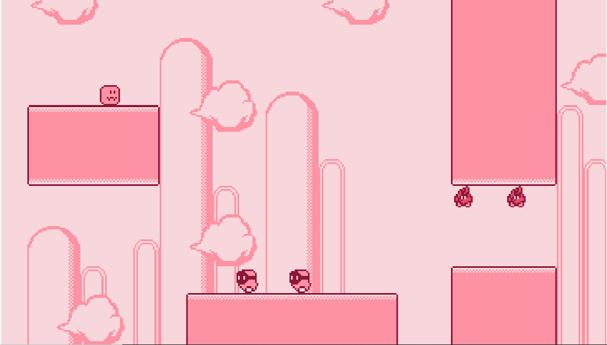

# membuat game platformer seperti kirby menggunakan TypeScript + Kaboom.js

## Bagaimana cara menjalankan proyek?

Dengan asumsi Anda telah menginstal `node`.
- Instal dependensi dengan `npm install`
- Jalankan secara lokal dengan `npm run dev`
- Bangun untuk produksi dengan `npm run build` dan folder dist akan muncul
